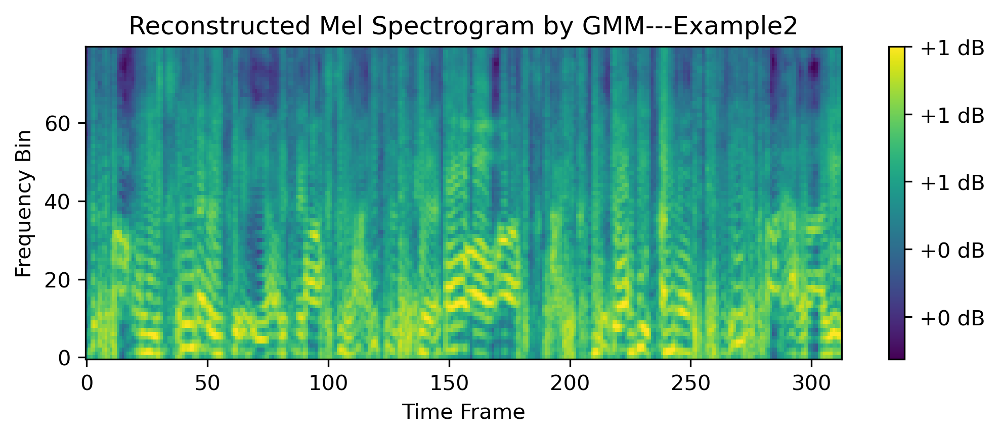
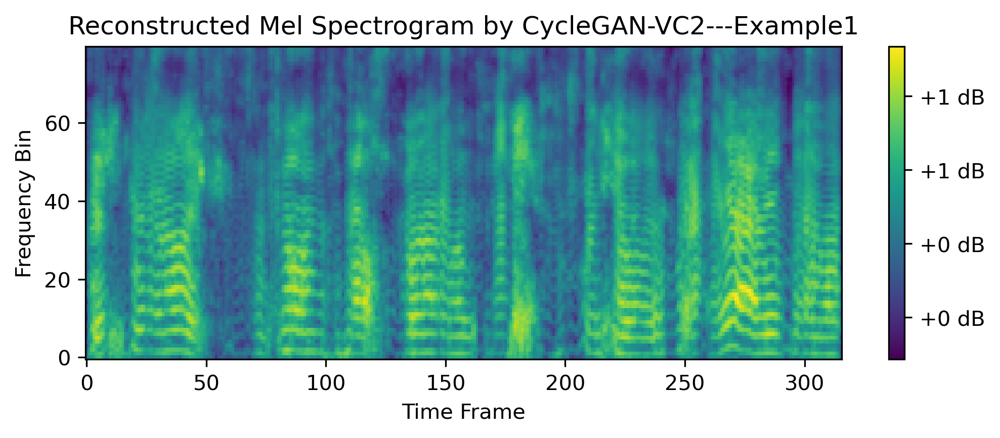

# OE-VI2

OE-VI2 is an occlusion effect-based in-ear voice input interface for earphones. We utilize the electro-acoustic (EA) model to conduct an occlusion effect-based correlation analysis between different channels. Based on such cross-channel correlation, we design an encoder-decoder learning network to reconstruct wide-bandwidth speech from narrow-bandwidth in-ear speech. To maintain the individual timbre information, we design a one-shot timbre auxiliary subnetwork to extract timbre embeddings. Through extensive real-world experiments with 28 participants, OE-VI2 can achieve an average MCD of 8.735, an average MSD of 0.893, and an average LSD of 11.956, outperforming existing solutions.

# 1. Description

Here we release four groups of examples, and each one includes 6 utterances:

***(1) ground truth airborne speech***

***(2) original in-ear speech***

***(3) reconstructed speech by our system: OE-VI2***

***(4) reconstructed speech by baseline1: GMM***

***(5) reconstructed speech by baseline2: CycelGAN-VC2***

***(6) reconstructed speech by baseline3: AutoVC***

[The model OE-VC is also available in [Model_OE-VC.py](./model_OE-VC.py) ]

# 2. Demo

The comparison of Mel spectrogram are displayed below.

|Method|Example1|Example2|Example3|Example4|
|------|--------|--------|--------|--------|
| In-ear Speech |  |  |  |  |
| Ground Truth |  |  |  |  |
| OE-VI2 |  |  |  |  |
| GMM |  |  |  |  |
| CycleGAN-VC2 |  |  |  |  |
| AutoVC |  |  |  |  |
