# 

OE-VI2 is an occlusion effect-based in-ear voice input interface for earphones that leverages inner microphones on the earphone to capture sound vibrations propagating along in-ear channels. The key idea of EarSpeech is that in-ear speech is less sensitive to ambient noise and exhibits a correlation with airborne speech which is sensitive to ambient noise. The goal of OE-VI2 is reconstructing the in-ear speech to improve the quality and intelligibility. Here, we release some audio demo samples to demonstrate the performance of OE-VI2. 

# 1. Description

Here we release four groups of examples, and each one includes 6 utterances:

***(1) ground truth airborne speech***

***(2) original in-ear speech***

***(3) reconstructed speech by our system: OE-VI2***

***(4) reconstructed speech by baseline1: GMM***

***(5) reconstructed speech by baseline2: CycelGAN-VC2***

***(6) reconstructed speech by baseline3: AutoVC***

# 2. Demo

The comparison of Mel spectrogram are displayed below.

## 2.1 Examples1 [Audio files are available in [audioDemo](./Example1) ]

 	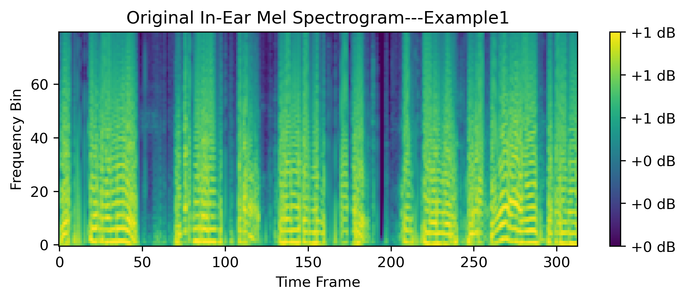 

 	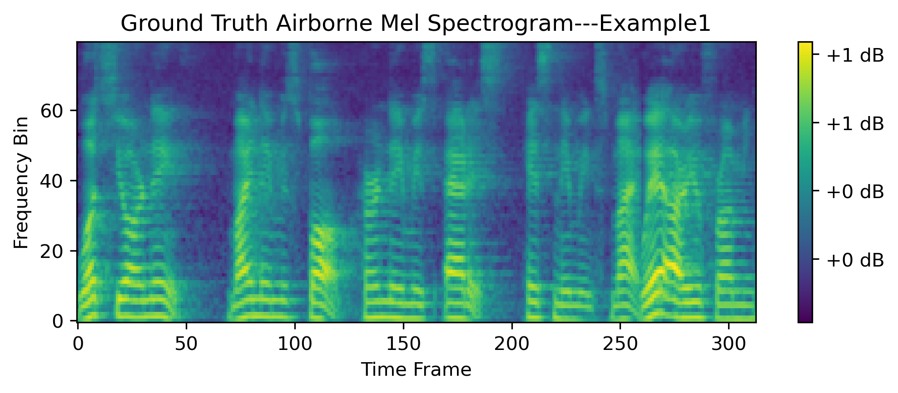 

 	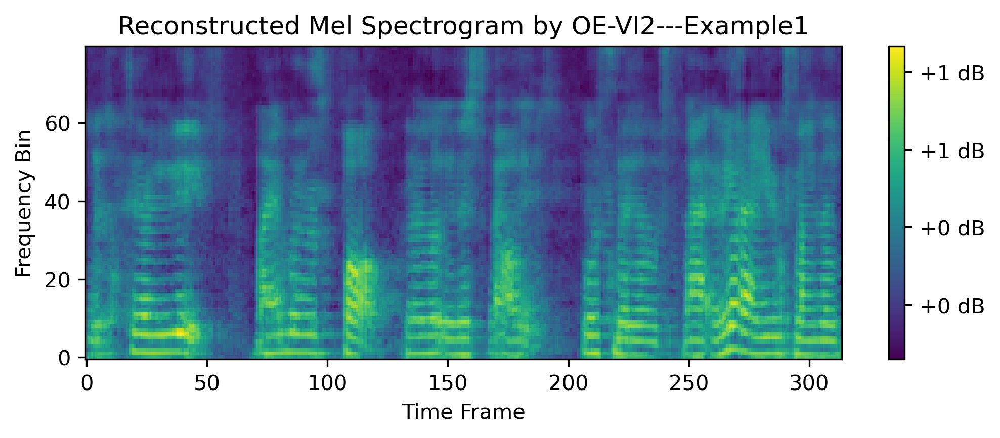 

 	 

 	 

 	 

## 2.2 Examples2 [Audio files are available in [audioDemo](./Example2) ]

 	 

 	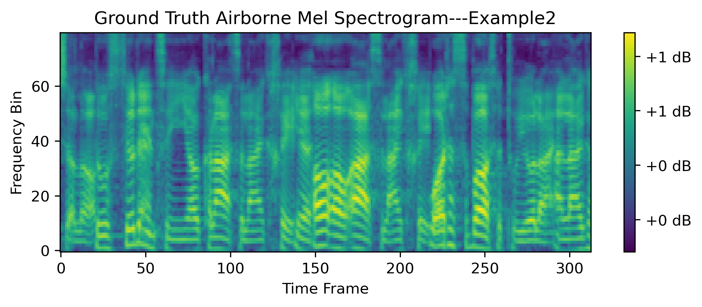 

 	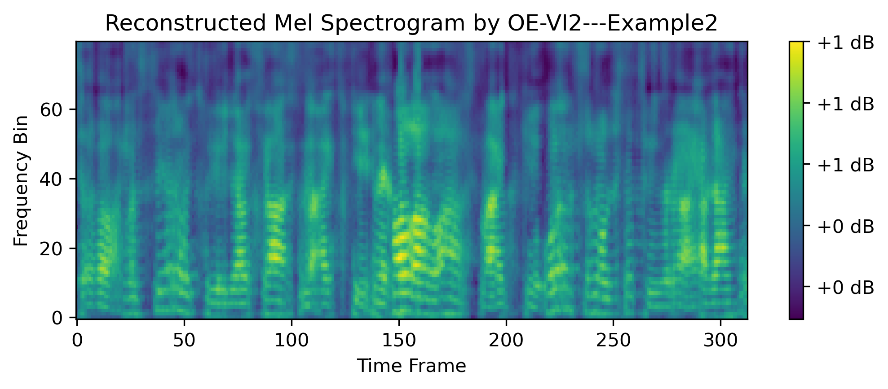 

 	 

 	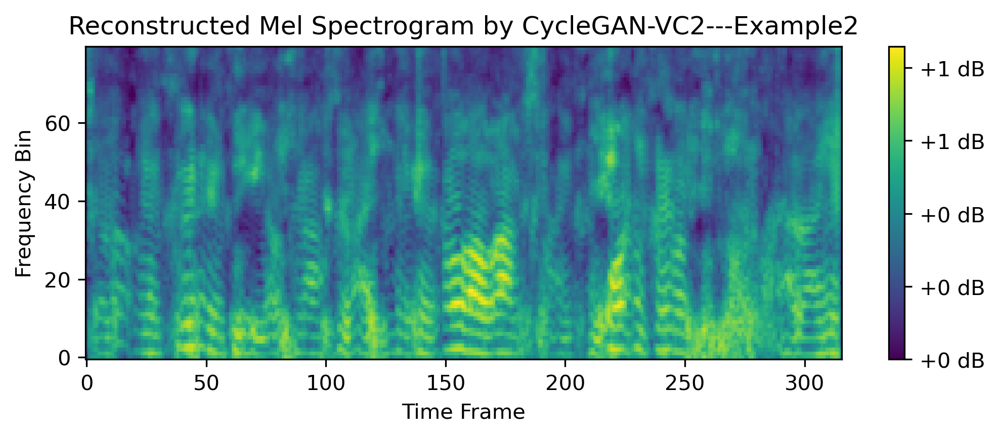 

 	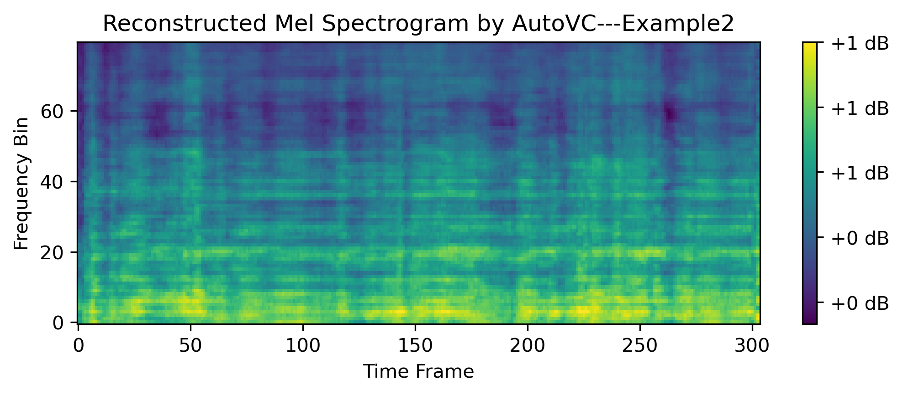 

## 2.3 Examples3 [Audio files are available in [audioDemo](./Example3) ]

 	 

 	 

 	 

 	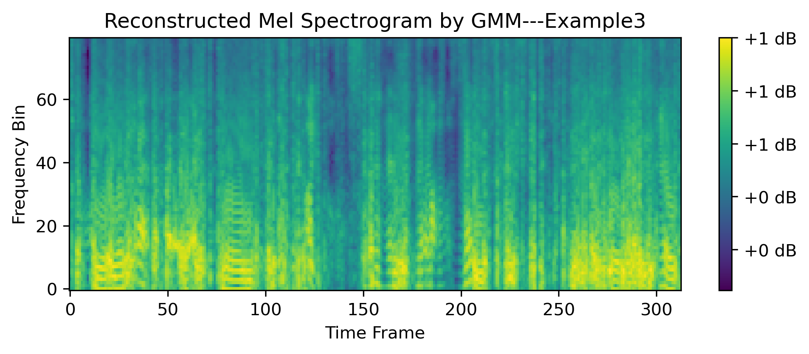 

 	 

 	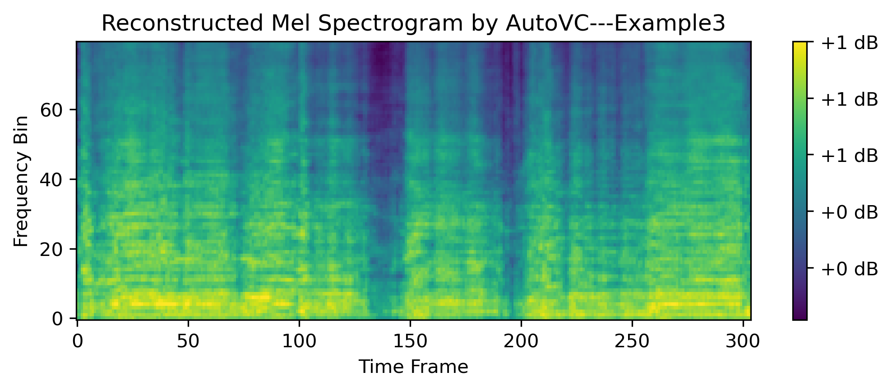 

## 2.4 Examples4 [Audio files are available in [audioDemo](./Example4) ]

 	 

 	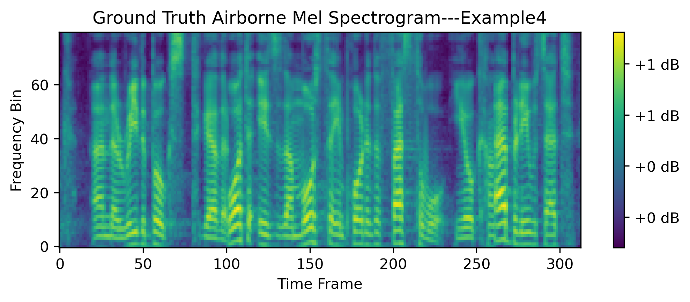 

 	 

 	 

 	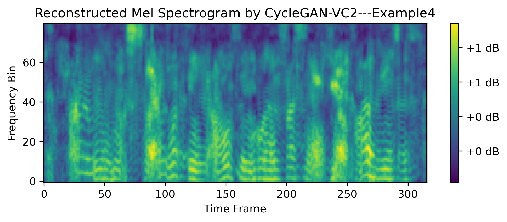 

 	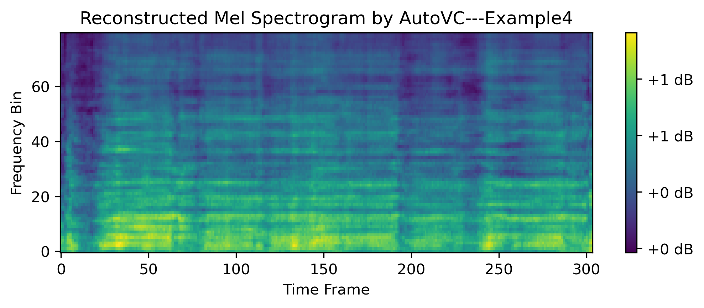 
